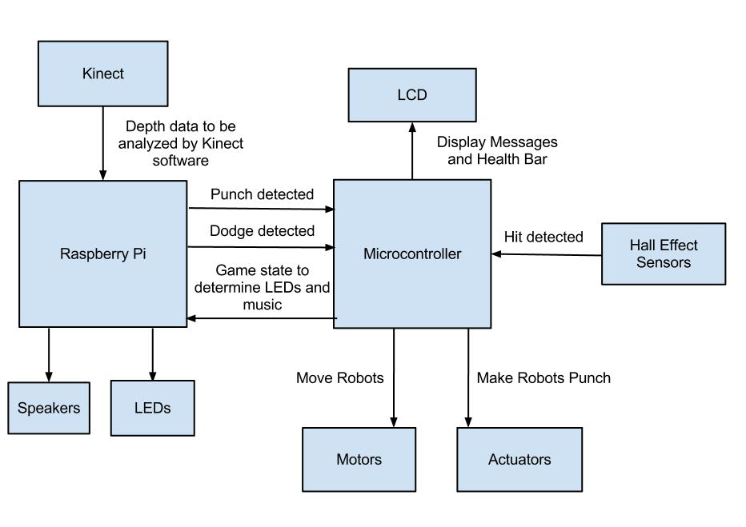

<!-- _backgroundColor: black -->
<!-- _color: white -->

<h1 class='title'>CSI4900/5900</h1>

## Software Engineering for Cyber-Physical Systems

#### Erik Fredericks (fredericks@oakland.edu)

#### Fall 2019

<hr size="5" />

## Course Introduction

---

# Overview

- Welcome
- Syllabus
- What are Cyber-Physical Systems?
- What do Raspberry Pis have to do with this?

---

# Welcome!


---


# Syllabus

- As always, the syllabus is worth reading
- Important topics like:
  - When is my final exam?
  - What is the grading breakdown?
  - What time does this class meet?
  - Where can I find the nifty textbook?
    - Joke's on you there is no textbook

---

# What we ***will*** cover

- Core software engineering concepts **as applied to CPSs**
  - Validation, verification, etc.
- Practical software engineering on **real-world devices**
  - Validation, verification, etc.
- Learning how to read **research papers**
  - AND
    - And
- Draw conclusions from them *quickly and efficiently*

---

# What we ***will not*** cover

- Anything ECE-related
  - We're going to assume these Pis are networked and *untouchable* microcomputers
    - They stay in their case, end of story
  - We're not going to be wiring them up to all sorts of sensors, unless prior permission is given
    - (You'll note we don't necessarily have the facilities for that sort of thing in this room)


---

# What do you want to cover?


---

# Knowledge you are assumed to have

- Able to use a Linux operating system
  - Navigate command line
  - Move files
  - Set permissions
  - etc.

---

# Knowledge you are assumed to have

- Able to program in **Python** (preferred) or **C/C++** (acceptable) or **Java** (non-preferred)
  - When I say non-preferred, it means all examples will be shown in **Python**
  - It will be up to you to translate to Java if you insist on using Java
    - The answer is **no**, I will not provide Java examples, let's be clear on that up front
    - C/C++ is possible, Java is a definite no


---

# How class will generally work

- Monday: **Lecture day**
  - Introduce concepts for week
  - Paper reminder
- Wednesday: **Work day**
  - Student paper presentation / discussion
  - Play time with the Raspberry Pis
- Depending on the week (or how class is going)
  - May split 1 hr lecture, 1 hr work

However….

---

# Student Presentations

We'll be taking turns presenting research papers that are relevant to the topic each week

- Consider this to be analogous to a seminar class
- You'll be provided with a paper template to get your thoughts down on paper

---

# Student Presentations

One student **each week** will be in charge of presenting their writeup to the class

- Slides not required, simply lead the discussion
- Everybody will be required to have read the paper prior to coming to class
- This talk will be brief, we just want the highlights and a short discussion

Does everybody need to fill out the template?

- **No, just the student leading the discussion**
- (but if you don't participate I'll know)

---

# Topic Presentation

Additionally, each student will be in charge of presenting 1 module to the class

- ~45-min - 1 hr presentation

I will provide the list of available topics in Moodle for you to choose from

---

# Topic Presentation

For instance, if you are interested in *Probabilistic Model Checking* you would present information gained from several papers

- We'd hear about model checking in general, how probability theory impacts that, what Kripke structures are, etc.
  - Oh neat, probabilistic model checking can be used at run time as well, we'd hear about that too

---

# Lab Time

In addition to how fun this class will be, this will be an additional layer of fun

Generally, lab time will be used for working on basic concepts that will help your term project along

We will not necessarily have a lab report, but you will need to demonstrate that you are making forward progress each week

Grading requirements will be provided with each lab manual


---

# Term Project

- Oh yes, there will be a term project
- You have the option of working on a team or by yourself
  - If on a **team**, then your project should have a level of difficulty/cooperation **between devices** that you could not accomplish alone
  - Meaning, if you have 2 or more people, there should be enough work done to merit a team
- You will need to write a proposal early on to convince me of the project's merit
  - With or without a team


---

# Term Project

- You will implement a **CPS of your choice** and you will **apply some form of software engineering to your CPS**
  - You have the option for both points
- An example:
  - I am implementing an Internet of Things (IoT) environment
  - I am performing software validation on my setup based on a test specification, and showing all the PASS/FAIL results
- Note that an IoT environment **requires** more than one device!
  - Assuming we don't hit the class limit, we should have extras

---

# Term Project

I expect that you'll be working on your term project throughout the semester, not just the last two weeks of class

We will have milestones that you'll have to meet
- Documentation, demonstrations, etc.

These will factor into your final term project grade

---

# Exams

Your midterm exam will take place at: ```<REF NOT FOUND>```

Your final exam will take place at: ```<REF NOT FOUND>```

No exams in this class, it is a seminar / project class

- Your project presentation will take the place of your final exam
- Your midterm exam will be one of the major term project milestones

As a result though, your discussion game had better be on point, as that will be graded with much more focus than normal!

---

# Questions so far?


---

# Introduce yourselves!

This class tends to be very interactive, so let's do the thing of introducing each other to each other


---

# Intro to Cyber-Physical Systems (CPS)

**What is a CPS?**

- "Engineered systems that are built from, and depend upon, the seamless integration of computational algorithms and physical components"
  - National Science Foundation
- Essentially, the cyber (programming) and physical (hardware) working together
  - Software logic
  - Execution timing
  - Physical forces

---

# Computing Technologies

- Computers
  - Devices that run software applications
    - E.g., user activities, processing, etc.
- Controllers (traditional)
  - Devices that interact with physical world
    - E.g., traditional thermostats
- Embedded systems
  - Specialized system that integrates microcontroller and software
    - E.g., smart watch, 'smart' thermostat

---

# Intro to CPS

Say that you have designed an embedded system, you program it, etc.

You've probably (assuming this is a real-world application) tested it, run it through your QA process, and validated it for use

Is it a CPS?

- Kind of!
- CPSs are highly-complex, may use multiple actors, experience diverse environments, etc.

---

# CPS


---

# Think of it this way...

* You're designing a system that uses a particular set of hardware
  * The hardware itself has been encased in a plastic box that doesn't dissipate heat very well
  * As a result, the processor slows down to avoid heat damage
  * And then, your real-time scheduling algorithm implemented on your device becomes invalid as it assumes the processor speed was X%, when in reality it is now Y%
* An environmental concern has invalidated our basic model
* A CPS would consider this!

---

# CPS Characteristics

"Convergence of communication, computation, and control"

A CPS:

- "Physical / engineered systems that are monitored/coordinated/controlled/integrated by a computing/communication core"
- "Integrates computing, communication, and storage with monitoring and/or control of entities in real world"

http://www.seas.upenn.edu/~lee/09cis480/lec-CPS.pdf

---

# CPS Characteristics

Cyber-physical coupling in *everything*

- Every physical device has some cyber in it (or, why a fridge needs to tweet?)
- Networking at scale

Novel interactions in communication/computing/control

- High degree of automation
- Large-scale control loops
- Many users within that loop -- mostly not technical either

***UBIQUITY***

---

# Example CPS Applications

Medical devices

Autonomous vehicles

Multi-agent systems (EFPL)

Internet of Things (IoT) environments

---


# EPFL (Switzerland)
https://www.youtube.com/watch?v=QUHn0r_j5cE

---

# Caveats...

CPSs can be **horrendously complex** and **highly safety-critical**


---

<!-- _color: white -->


# Case Study : Ariane 5

- Ariane 5 rocket -- created by European Space Agency
- Required **10 years** and **$7 billion** to build
- In under a minute after launch, the rocket exploded
  - As a result of…
    - Trying to put a 64-bit number into a 16-bit variable

*A bug and a crash, J. Gleick, New York Times, Dec 1996*

---

# Case Study : Toyota Prius Braking

Delay in brake software caused vehicles to brake slower than expected

If traveling 60mph, the brakes didn't trigger until ~90ft beyond initial brake press

Disconnect in the anti-lock brake system (ABS) -- &lt; 1 second lag

*CNN Feb 4, 2010*

---

# Case Study : Inadvertent Radiation Overdose

- Let's talk about the **Therac-25**
  - Radiation therapy machine (chemotherapy)
  - Iteration over the well-used Therac-6
    - Now completely software-controlled
      - ... Including safety mechanisms
      - Hey, it's probably cheaper to have everything be software-controlled, right?
  - Machine was extensively tested and verified over several years
    - A single programmer wrote all the code
    - Unit testing and general SW testing was minimally done

*Leveson 1993*

http://www.cs.umd.edu/class/spring2003/cmsc838p/Misc/therac.pdf

---

# Therac-25

11 units were installed in the US and Canada

- **Six** massive overdoses of radiation were reported

Why?

- Program faults from the Therac-20 software codebase that were not previously detected
  - Well, why weren't they detected?
    - Because the **hardware interlocks** prevented the machine from ever entering a state
    - Now that it was completely SW-controlled, well, no safety mechanism existed to prevent overdose

---

# Therac-25

Effectively this problem results from **race conditions** and **concurrency errors**

But, the human element is also to blame

- Medical staff initially did not believe that their machine was causing the problems
- Improper training led staff/nurses to use shortcuts or rapid key entries that caused the machine to go into the wrong power mode
- From Wiki (https://en.wikipedia.org/wiki/Therac-25#Additional_reading):

---

# Therac 25

`The failure only occurred when a particular nonstandard sequence of keystrokes was entered on the VT-100 terminal which controlled the PDP-11 computer: an "X"; to (erroneously) select 25 MeV photon mode followed by "cursor up", "E" to (correctly) select 25 MeV Electron mode, then "Enter", all within eight seconds. This sequence of keystrokes was improbable, and so the problem did not occur often and went unnoticed for a long time.`

---

# What does this tell us?

**Not** that the engineers were incompetent.  A **lot** of effort went into designing and testing these systems.

It tells us that testing is **never** complete and **it is impossible to consider every single conceivable issue**

Could a Lint test have solved the Ariane-5 explosion?  Possibly

Could extensive human testing have solved the &lt;X&gt; catastrophe?  Maybe, maybe not.

**Therefore, it is important to verify and test as much as possible prior to release!**

---

# So software engineering...

Historically, probably some of the driest classes you will get (unless if you have one of our nifty professors, naturally)

But that's all stuff that you do in the working world, right?

Specifications, testing, verification.  That's the bland side of programming.

Where's the excitement?  Where's the sex appeal?

---

# Well...

This is also why I feel that programmers should have the same requirement as Mechanical Engineers to be tested for a Professional Engineer license.

**People's lives can and will be at stake as a result of your programming.**


---

# Software Engineer's Responsibilities

Assume you programmed the Therac-25

You are **directly (or indirectly) responsible** for causing severe radiation burns, at least one of which resulted in a breast amputation


---

# Software Engineer's Responsibilities

Now that (I assume) you're scared straight

Be responsible when you program.  It's not a game.  People's lives will be affected by your actions.

```/end soapboxing```

---

# So now that we're all mortified...

- In this class, we will consider software engineering concepts in terms of real-world CPSs
- The SE techniques we apply **will directly affect** operation of the CPS

- Examples:
  - Run-time requirements monitoring that **directly feeds back into the CPS controller**
  - Software verification that enables us to **derive run-time system states**

---

# So why are we in this lab?

Well I'm glad you asked...

---

# Raspberry Pi

- Low-cost microcomputer:  ~$35 + parts
- Runs on multiple OSs
  - We'll be using Raspbian Linux
- Uses microSD card for OS
- Wonderful capabilities
  - WiFi
  - Bluetooth
  - HDMI
  - USB
  - etc.
- <http://www.raspberrypi.org/>

---

# Specifications

- SoC: Broadcom BCM2837 (32KB L1 cache, 512KB L2 cache)
- CPU: 4x ARM Cortex-A53 @ 1.2GHz
- GPU: Broadcom VideoCore IV
- RAM: 1GB LPDDR2 (900MHz)
- Networking: 10/100 Ethernet, 2.4GHz 802.11n wireless
- Bluetooth: 4.1 classic, low energy
- Storage: microSD
- GPIO: 40-pin header
- Ports: HDMI, 3.5mm A/V, 4x USB2.0, Ethernet, Camera Serial Interface (CSI),
- Display Serial Interface (DSI)
- <https://www.raspberrypi.org/magpi/raspberry-pi-3-specs-benchmarks/>

---

# Caveats

Due to lab/school restrictions, the Raspberry Pis *cannot leave this lab*

...unless you sign this handy waiver

The Pis will be available via SSH and distributed to you at the start of class, but will be otherwise **locked away**.

This is because they are:

- Fragile
- Tiny
- Prone to walking away

---

# However

You can emulate the Raspberry Pi environment!

- VirtualBox + Pi ISO

Given that we're not really working with the GPIO pins anyway

This will enable you to work outside of the lab

- *May have future lab going over this, if time*

---

# Programming Environments

Python installed **by default**

But, anything that can run on an ARMv6 chip can be installed

- Java is possible

If installing Raspbian (Linux-based distro for Pi)

- Minecraft
- SCRATCH game maker
- Other fun stuff

---

# Pi Demo

- Logging in
- Showing the kernel version
- Date
- CPU temperature

---

# Pi Demo - LOGGING IN

## FROM YOUR MACHINE

```$ ssh pi@192.168.1.X```

Default password is ```raspberry```

Change it ***immediately*** to something else

```$ passwd```

---

# Pi Demo - KERNEL VERSION / DATE

Kernel version: ```$ uname -a```

Date: ```$ date```

---

# Pi Demo - OTHERS

CPU temperature: ```$ /opt/vc/bin/vcgencmd measure_temp```

Configuration menu: ```$ sudo raspi_config```

Shutdown / reboot:  ```$ sudo shutdown -h now   /   $ sudo reboot```

More for reference

- <http://www.circuitbasics.com/useful-raspberry-pi-commands/>

---

# Connecting to the Lab Pis

Each of you will be assigned an **IP ADDRESS** that resolves to your particular Pi

- This address will be accessible **ONLY IN THIS LAB**
  - (Believe me, I've tried to make this to be not the case)

---

# Connecting to the Lab Pis

To connect to your Pi, the syntax is:

```$ ssh pi@<IP ADDRESS>```

Or

Just plug into a monitor!

- You'll need a keyboard and mouse as well

---

# Groupwork -- Design a Cruise Control System

<table>
<tr>
  <td style="background:white; border: 0px">

I want you to design a simple cruise control system using block diagrams

- Think about a car
  - What systems are required to have cruise control?  What kinds of sensors?  What kinds of data will ***flow*** between those sensors?

  </td>
  <td style="background:white; border: 0px">



  </td>
</tr>
</table>


---

# Additional References

- <https://www.slideshare.net/ltg_oxford/raspberry-pie-an-introduction>
- <http://www.seas.upenn.edu/~lee/09cis480/lec-CPS.pdf>