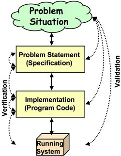
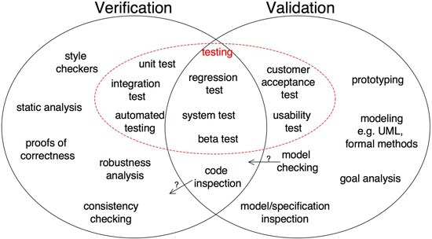
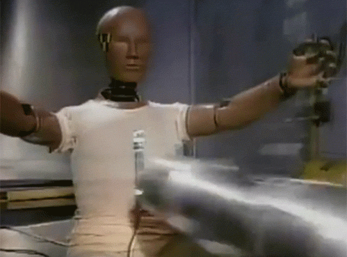
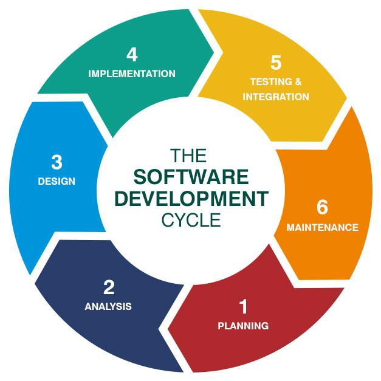

<!-- _backgroundColor: black -->
<!-- _color: white -->

<h1 class='title'>CSI4900/5900</h1>

## Software Engineering for Cyber-Physical Systems

#### Erik Fredericks (fredericks@oakland.edu)

#### Fall 2019

## Software Engineering Topics

---

# Topics for Today

- High-level software engineering concepts we'll be concerned with

---

# Overarching Goals

Trustworthy

- Minimize failures and provide graceful failsafe
- The CPS' capabilities should never be questioned by the public

Context-/Situation-Aware
- Able to deal with complex and diverse situations in real-time
- Make decisions with limited resources

<http://www.seas.upenn.edu/~lee/09cis480/lec-CPS.pdf/>

---

# Overarching Goals

Seamless integration

- CPSs should be effectively invisible to the public and just be a 'part of everyday life'
- Be integrated locally, regionally, and nationally

Validation/Verification/Certification

- Provide **assurance** that our system functions correctly
- Software Assurance:
  - ***The level of confidence that software is free from vulnerabilities, either intentionally designed into the software or accidentally inserted at any time during its lifecycle, and that the software functions in the intended manner. (℅ wikipedia)***

---

# SE Topics

Verification

- Mathematically **proving** that your system functions **correctly** according to a software **model**

Validation

- Extensively **testing** system functionality in many situations to demonstrate that it functions according to its **requirements**

Traceability

- **Links** between requirements and software test cases

---

# V&amp;V Distinctions

Validation: Are we building the right system?

Verification: Are we building the system right?

<http://www.easterbrook.ca/steve/2010/11/the-difference-between-verification-and-validation/>

---

# V&amp;V Distinctions

---

# SE Challenges

What are the challenges that impact a CPS?

- Real-world environments
  * Need to be able to both **model** and **test** unpredictable environments
  * **Uncertainty**
- Human interactions
  * Do we ever **really** know what a human will do in any given **situation**?
  * More **uncertainty**
- Heterogeneous systems
  * May have a Raspberry Pi, Arduino, proprietary chip, all in one system!
  * Do we actually **know** if there will be any odd interactions?

---

# The Takeaway...

## <!-- fit -->UNCERTAINTY

makes our lives difficult...

---

# Uncertainty

Something we will discuss IN DETAIL next lecture

But for us,

- Uncertainty is why we can't perform formal verification and call it a day
  - That's just not how the real world works

---

# A Brief Review (hopefully review…)

Software design lifecycle

Software artifacts

---

# Software Design Lifecycle

- UML diagrams
  - State, actor, class, etc.
- Requirements specifications
- Architectural models
- Test specifications

---

# Now consider, for a hot minute

- That these artifacts can work for us at **run time**
  - (Welcome to the world of models @ run.time -- future lecture)

---

 
 
 
 

- But first, let's consider a high-level model for capturing **requirements and key objectives**
- On to KAOS goal modeling!
