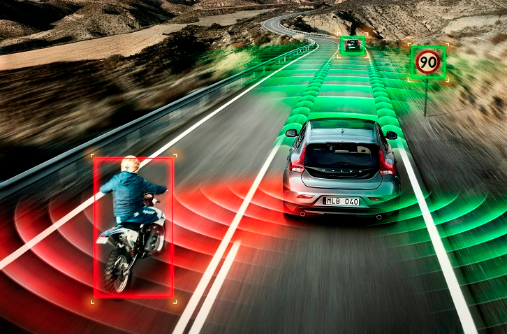
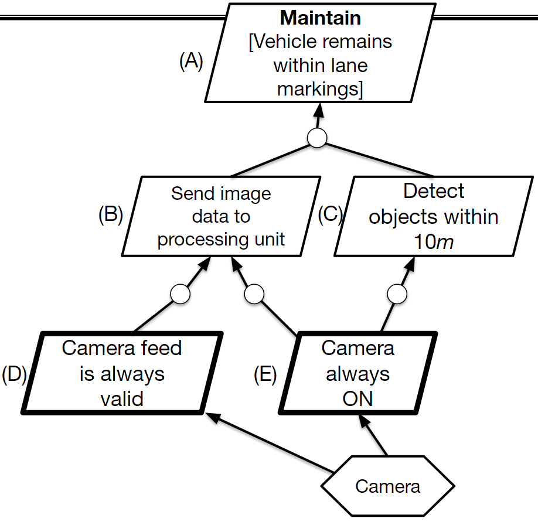
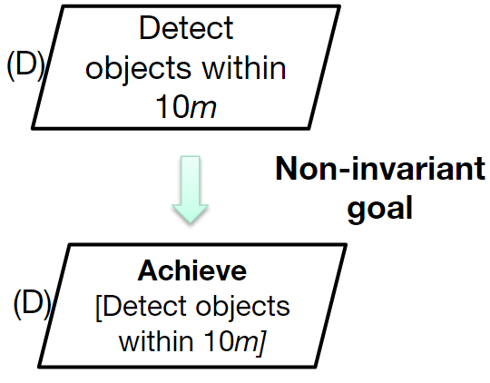
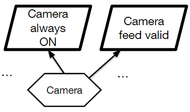
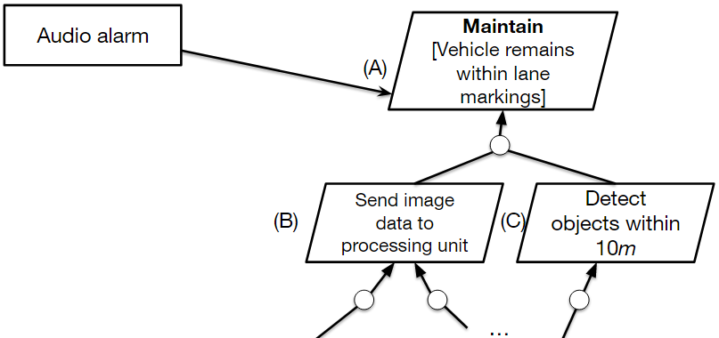
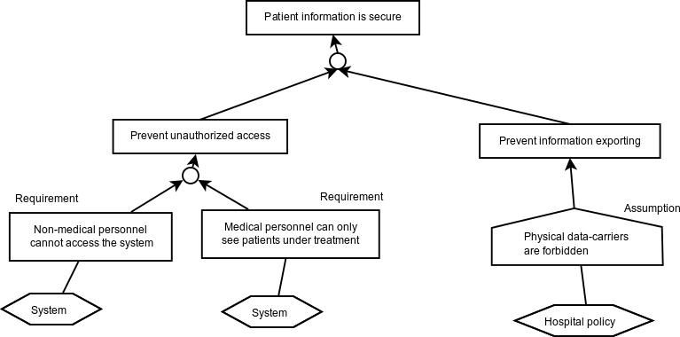

<!-- _backgroundColor: black -->
<!-- _color: white -->

<h1 class='title'>CSI4900/5900</h1>

## Software Engineering for Cyber-Physical Systems

#### Erik Fredericks (fredericks@oakland.edu)

#### Fall 2019

<hr size="5" />

## KAOS Goal Modeling
(Slides adapted from MSU CSE914)

---

# Introduction to KAOS Goal Modeling

- What is goal modeling?
- Goal modeling with KAOS
- Models at run time

---

# What is goal modeling?


- What is a goal?
  - Representation of stakeholder objectives<br /><br />
- Who are the stakeholders?
  - Anybody interested in system
    - Developers, customers, maintainers, etc.<br /><br />
- What is a goal model?
  - Hierarchical arrangement of goals
  - Demonstrates relationships between goals

---

# What are goals?

Examples of goals:

- Camera sensor must have 180 degree field of view
- Radar sensor is always on
- All sensors must provide reliable data

Examples of non-goals:

- Camera software implemented in C
- Radar housing painted red

---

# Goal Hierarchy

- Goals can be decomposed from **high-level objectives** to **low-level requirements**

- Each goal refined with sub-goals that define how it can be satisfied

- Leaf-level goals are considered to be ***requirements / expectations***

---

# Goal Hierarchy


---

# Running Example

- Autonomous vehicle
  - Different types of sensors
    - E.g., camera and radar

  - Main objective: keep vehicle **within lane**

<center>



</center>

---

# High-level vs. low-level goals

- Order these goals from high level to low level
  - Camera sensor provides data to processing unit
  - Vehicle must always stay within lane markings
  - Camera sensor must always be ON
  - Camera sensor detects objects within 10 meters

---

# High-level vs. low-level goals

- Order these goals from high level to low level
  - Camera sensor provides data to processing unit
  - **(1) Vehicle must always stay within lane markings**
  - Camera sensor must always be ON
  - Camera sensor detects objects within 10 meters

---

# High-level vs. low-level goals

- Order these goals from high level to low level
  - **(2) Camera sensor provides data to processing unit**
  - (1) Vehicle must always stay within lane markings
  - Camera sensor must always be ON
  - Camera sensor detects objects within 10 meters

---

# High-level vs. low-level goals

- Order these goals from high level to low level
  - (2) Camera sensor provides data to processing unit
  - (1) Vehicle must always stay within lane markings
  - Camera sensor must always be ON
  - **(3) Camera sensor detects objects within 10 meters**

---

# High-level vs. low-level goals

- Order these goals from high level to low level
  - (2) Camera sensor provides data to processing unit
  - (1) Vehicle must always stay within lane markings
  - **(4) Camera sensor must always be ON**
  - (3) Camera sensor detects objects within 10 meters

---

# High-level vs. low-level goals

- Order these goals from high level to low level
  - Vehicle must always stay within lane markings
  - Camera sensor provides data to processing unit
  - Camera sensor detects objects within 10 meters
  - Camera sensor must always be ON

---

# Types of goals

- **Functional goals**
  - "Hard" goals
  - Functions that system will perform
  - Well-defined criteria for satisfaction
    - E.g., vehicle always stays within lane markings
- **Non-functional goals**
  - "Soft" goals
  - Desired system qualities
  - Hard to define and quantify
  - Reliability
  - Quality
    - E.g., automatic stop is not jarring to passenger

---

# Types of goals

- **Safety goals**
  - Ensure system consistently runs safely
  - Does not endanger people or system itself
    - E.g., sensor automatically shuts off if voltage exceeds maximum

- **Failsafe goals**
  - Provide safe fallback state in case of error
    - E.g., system shuts off if camera sensor is damaged

---

# Goal exercise

Identify the **goals** in the following paragraph:

> Company X is designing a new autonomous vehicle.  Their autonomous vehicle system comprises at least two sensors: a camera and a radar.  Both the camera and radar are responsible for sensing objects at a minimum distance of 10 meters.  These sensors can communicate to a CPU via a secure CAN bus, at which point the CPU parses the incoming data. For safety purposes, at least one sensor must be active at all times.

---

# Goal exercise

Identify the **goals** in the following paragraph:

> Company X is designing a new autonomous vehicle.  Their autonomous vehicle system comprises ```at least two sensors```: a camera and a radar.  Both the camera and radar are responsible for ```sensing objects at a minimum distance of 10 meters```.  These sensors can ```communicate to a CPU``` via a secure CAN bus, at which point the ```CPU parses the incoming data```.  For safety purposes, ```at least one sensor must be active at all times```.

---

# Why do we use goal models?

* Provide rationale for requirements

* Identify stable information in system objectives

* Guide requirements elaboration / elicitation

* Provide visual depiction of relationships and dependencies between objectives

---


---

# When to use goal models

- Early in requirements engineering process
  - Identify problems
  - Explore solutions and alternatives
  - Performed prior to UML modeling
  - Continually refine goal model as new requirements or obstacles surface

<center>


</center>

---

# Goal modeling with KAOS

- Different approaches exist for creating goal models
  - KAOS, i*, UML (use cases)

- We will be using KAOS in this class for goal modeling

---

# KAOS notation

- Refine goals into requirements

- Objects in KAOS goal model
  - Goal
  - Agent
  - Requirement / Expectation
  - Refinements

---

# KAOS notation


---

# KAOS notation

- Goals


---

# KAOS notation

- Agent
  - Agent can be human or sensor


---

# KAOS notation

- Requirement/expectatoin

  - Requirement:

    - Automated component responsible

  - Expectation:

    - Environment responsible


---

# KAOS notation


---

# KAOS notation


---

# Goal categories

- Invariant
  * Must **ALWAYS** be satisfied
  * Safety, failsafe, or system invariants
  * E.g., vehicle can never collide with an obstacle

- Non-invariant
  * Temporarily **tolerates** unsatisfied goal
  * Transient conditions
  * E.g., temporary sensor blockage / occlusion

---

# Goal examples


---

# Goal examples

- **Avoid** also considered invariant
  - E.g., **Avoid** [Collision]


---

# Goal examples



---

# Goal examples



---

# Goal examples


---

# Goal examples

* All have been functional so far

* What about non-functional goals?
  * Soft / fuzzy goals?


---

# Goal examples

* **No difference between functional and non-functional goal in KAOS!**


---

# Using models at run time

- Goal models can provide measure of system performance

- Is system satisfying its invariants?

- How well is system satisfying its non-invariants?

---

# Utility functions

- Derived mathematical function for each goal

- Provides **degree of satisfaction** for each goal

  * Normalized on [0.0, 1.0]

  * 0.0 	➔ goal is <font color="red">**violated**</font>

  * 1.0 	➔ goal is <font color="green">**satisfied**</font>

  * (0.0,1.0)	➔ goal is <font color="teal">***satisfied to some degree (i.e., "satisficed")***</font>

---

# Goal examples


<div style="background:yellow;padding:20px">

Invariants are typically **boolean** functions

**Goal (A) = 1.0** ***if vehicle has never crossed lane boundary***

**Goal (A) = 0.0** ***otherwise***

**Also, Goal (A) = 0.0 if (Goal (B) = 0.0) OR (Goal (C) = 0.0)**

</div>

---

# Goal examples

<div style="background:yellow;padding:20px;margin-bottom:20px;">

- Non-invariants are typically real functions

$Goal~(C) = 1.0 – \frac{|distance_{detected}-distance_{max}|}{distance_{max}}$

</div>

<div style="background:limegreen;padding:20px">

***Detected at $8m$ instead of $10m$***

$Goal~(C) = 1.0 - \frac{|8.0 - 10.0|}{10.0}$

$Goal~(C) = 0.8$

</div>


---

# What can we do with a utility value?

- Determine if an objective has been violated
  - Or, determine if an objective is not being satisfied *enough*

- Refactor goal model

- Introduce a bugfix or patch

- Reconfigure system

---

# Assignment Part 1

Derive goal model based on requirements specification for your term project

- Must have at minimum:
  - **(2)** Invariant goals
  - **(6)** Non-invariant goals
  - **(3)** System agents
  - **(2)** AND- and **(2)** OR- refinements

---

# Other types of KAOS models

- Responsibility models

- Operation models

- Object models

- Obstacle models

---

# Responsibility models

- Describes:
  - Agent
  - Requirements/expectations agent is responsible for

<center>



</center>

---

# Object models

- Objects can be entities within a goal model (that are not agents)
  - Audio alarm if vehicle crosses lane marking

<center>



</center>

---

# Operation models

- Describes behaviors agents need to fulfill the goals they are responsible for
  - Requirements/expectations

<center>


</center>

---

# Obstacle models

- Defines an obstacle to goal satisfaction
- Attempt to identify resolve obstacles in advance by refining goal model

<center>


</center>

---

# Agents/Assumptions

<center>



</center>

<a style="font-size:0.9em" href="http://foswiki.cs.uu.nl/foswiki/pub/MethodEngineering/ACaseStdElicScalReq1314/figure1.png/">foswiki</a>

---

# <!-- fit -->MetaModel

<a style="font-size:0.9em" href="http://www.respect-it.com/uploads/pics/kaos_metamodel_en_01.jpg">Respect-IT</a>


---

# Assignment Part 2

- For your original goal model:
  - Define at least 2 utility functions to assess the satisfaction and/or satisficement of a goal
  - Identify sources of uncertainty and how to account for them in your goal model?

- Define an obstacle model to complement your homework assignment
  - Define **(2) obstacles** to the success of your goal model
  - Provide a strategy for resolving each
